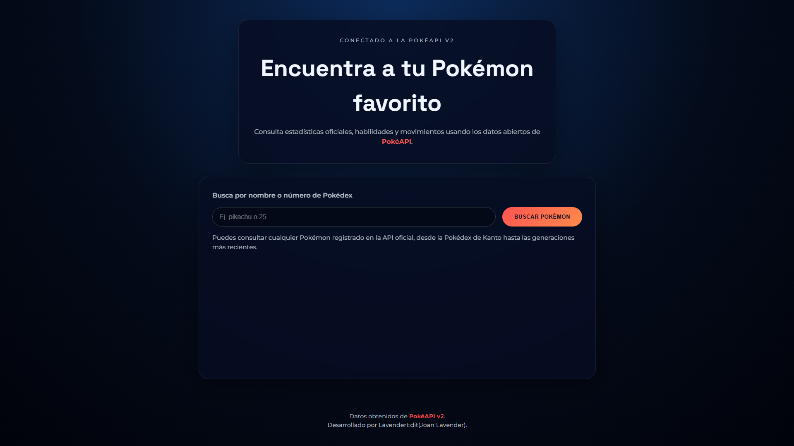
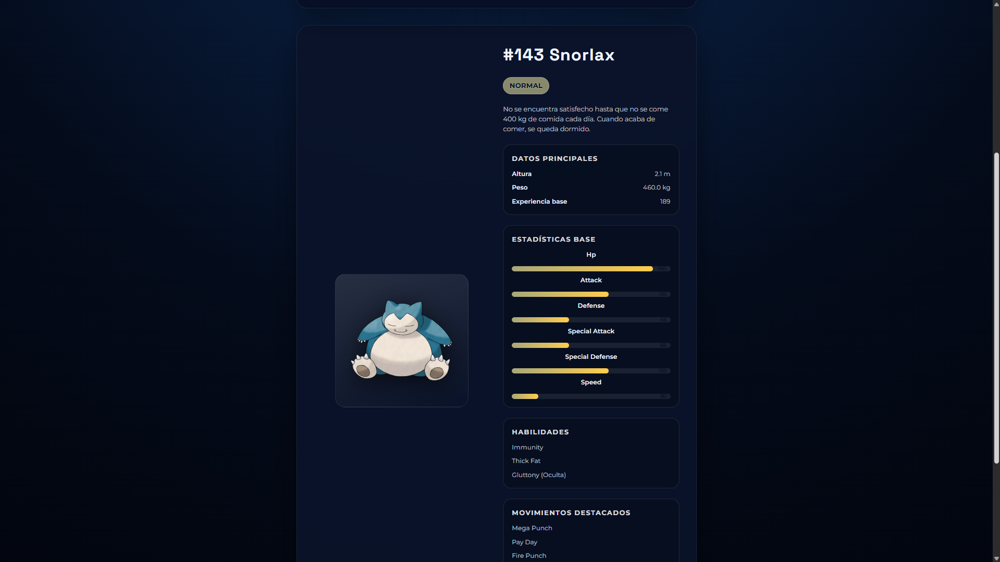

# Pokemon Search

> [Versión en Español AQUI!](README.md)

### 🌐 Live Demo
- **Published site:** [lavenderedit.github.io/BusquedaPokemon](https://lavenderedit.github.io/BusquedaPokemon/)

### 📖 Overview
BusquedaPokemon is a web application for browsing Pokémon information across every generation. It offers fast search, filtering, and rich details in a friendly, responsive interface, making it ideal for fans who want an interactive Pokédex-style index.

### ✨ Key Features
- Instant search by name or Pokédex number.
- Filters by elemental type and generation.
- Detailed stat display and flavor descriptions.
- Mobile-first design that scales to desktop screens.
- Accessibility-minded layout focused on clarity and performance.

### 🛠️ Tech Stack
- **HTML5** for the page structure.
- **CSS3** (Flexbox & Grid) for responsive styling.
- **JavaScript (ES6+)** powering the search logic and dynamic rendering.
- **PokeAPI** as the primary data source.

### 🚀 Run locally
1. Clone the repository:
   ```bash
   git clone https://github.com/LavenderEdit/BusquedaPokemon.git
   ```
2. Enter the project folder:
   ```bash
   cd BusquedaPokemon
   ```
3. Open `index.html` in your preferred browser:
   - Double-click the file, or
   - Serve it with a local static server (e.g., VS Code Live Server).

### 🧩 Project structure
```
BusquedaPokemon/
├── CSS/              # Stylesheets
├── IMG/              # Icons and images
├── JS/               # Application scripts
└── index.html        # Entry point
```

### 🖼️ Gallery
Landing Page


Search


### 🗺️ Roadmap
- [X] Add dark mode.
- [X] Implement persistent user favorites.
- [X] Introduce a Pokémon stat comparison tool.
- [X] Localize dynamic content into multiple languages.

### 🤝 Contributing
Contributions are welcome! Please open an issue to discuss improvements or report bugs, and submit pull requests following Git best practices.

### 👤 Author
**LavenderEdit (Joan Lavender)**
- 💌 Email: [gercermagden@gmail.com](mailto:gercermagden@gmail.com)
- 🎮 Steam: [steamcommunity.com/profiles/76561198872021096](https://steamcommunity.com/profiles/76561198872021096/)
- 💼 LinkedIn: [Juan Santos Pimentel Lalangui](https://www.linkedin.com/in/juan-santos-pimentel-lalangui-873a0a2a9/)
- 🌀 Zenless Zone Zero team: [enka.network/zzz/1000327138/](https://enka.network/zzz/1000327138/)

### 🙌 Acknowledgements
- Thanks to the [PokeAPI](https://pokeapi.co/) community for providing open data.
