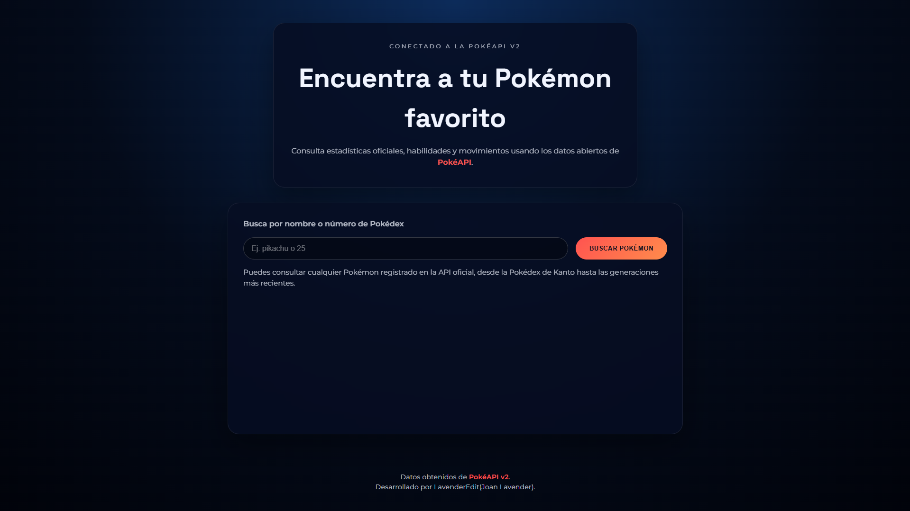
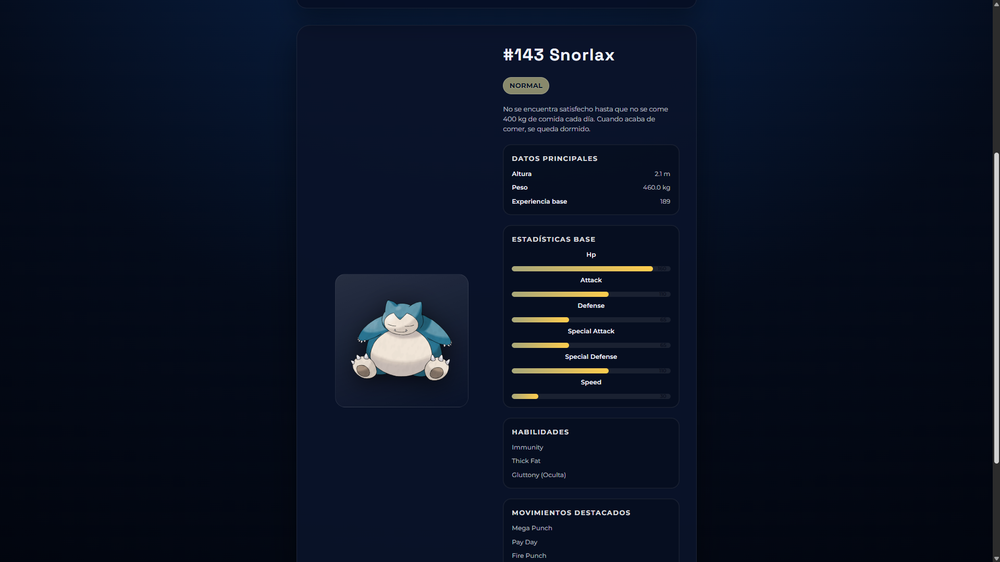

# BusquedaPokemon

> [English version HERE](#)

### 🌐 Demo en vivo
- **Sitio publicado:** [lavenderedit.github.io/BusquedaPokemon](https://lavenderedit.github.io/BusquedaPokemon/)

### 📖 Descripción general
BusquedaPokemon es una aplicación web para consultar información de los Pokémon de todas las generaciones. Permite filtrar, buscar y explorar datos relevantes de cada criatura de manera rápida, amigable y responsive, ideal para fans que buscan un índice interactivo tipo Pokédex.

### ✨ Características principales
- Búsqueda instantánea por nombre o número de Pokédex.
- Filtros por tipo elemental y generación.
- Visualización de estadísticas clave y descripciones.
- Interfaz optimizada para dispositivos móviles y de escritorio.
- Diseño intuitivo con énfasis en accesibilidad y rendimiento.

### 🛠️ Tecnologías utilizadas
- **HTML5** para la estructura del sitio.
- **CSS3** (con Flexbox y Grid) para estilos responsivos.
- **JavaScript (ES6+)** para la lógica de búsqueda y renderizado dinámico.
- **PokeAPI** como fuente principal de datos.

### 🚀 Cómo ejecutar el proyecto localmente
1. Clona el repositorio:
   ```bash
   git clone https://github.com/LavenderEdit/BusquedaPokemon.git
   ```
2. Entra en la carpeta del proyecto:
   ```bash
   cd BusquedaPokemon
   ```
3. Abre `index.html` en tu navegador favorito:
   - Doble clic en el archivo, o
   - Sirve el sitio con un servidor estático (por ejemplo, usando VS Code Live Server).

### 🧩 Estructura del proyecto
```
BusquedaPokemon/
├── CSS/              # Hojas de estilo
├── IMG/              # Iconos e imágenes
├── JS/               # Scripts de la aplicación
└── index.html        # Punto de entrada
```

### 🖼️ Galería
Página Principal


Busqueda


### 🗺️ Roadmap
- [X] Agregar modo oscuro.
- [X] Añadir favoritos persistentes por usuario.
- [X] Incluir comparador de estadísticas entre Pokémon.
- [X] Traducir contenido dinámico a múltiples idiomas.

### 🤝 Contribuciones
Las contribuciones son bienvenidas. Abre un *issue* para proponer mejoras o reportar errores y envía *pull requests* siguiendo las buenas prácticas de Git.

### 👤 Autor
**LavenderEdit (Joan Lavender)**
- 💌 Correo: [gercermagden@gmail.com](mailto:gercermagden@gmail.com)
- 🎮 Steam: [steamcommunity.com/profiles/76561198872021096](https://steamcommunity.com/profiles/76561198872021096/)
- 💼 LinkedIn: [Juan Santos Pimentel Lalangui](https://www.linkedin.com/in/juan-santos-pimentel-lalangui-873a0a2a9/)
- 🌀 Equipo en Zenless Zone Zero: [enka.network/zzz/1000327138/](https://enka.network/zzz/1000327138/)

### 🙌 Agradecimientos
- A la comunidad de [PokeAPI](https://pokeapi.co/) por el acceso gratuito a los datos.
